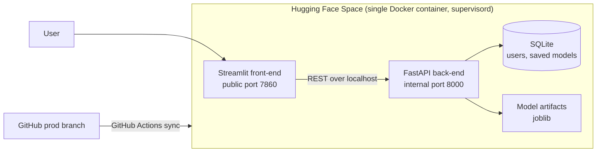

# MindPredict

**Predicting mental health conditions from clinical hospital data using machine learning.**

MindPredict is a full-stack machine learning web application built as our RMIT University capstone project and delivered to client stakeholders. Users can explore a clinical dataset, configure and train models, and compare detailed evaluation results for three mental health conditions: **depression, anxiety and stress**.

> **About this repository:** this is a showcase of the project and my part in it. The source code lives in a private team repository, and no patient data, datasets or trained models are included here. The project used data derived from MIMIC-IV, which is only available to credentialed researchers under a data use agreement.

## Demo video

🎥 **In another link:** a short walkthrough of the deployed app.
<!-- Replace the line above with: [Watch the demo](YOUR-YOUTUBE-LINK) -->

<!-- Add screenshots here (demo data only, no patient-level rows visible):

-->

---

## What the app does

| Page | What users can do |
|---|---|
| **Home** | Overview of the project and navigation |
| **Data Exploration** | Live exploratory data analysis: patient and admission counts, age, gender, admission type and insurance breakdowns, mental health trends over time, and medication patterns |
| **Model** | Choose a model, tune its hyperparameters, set the train/validation/test split and run an experiment |
| **Results** | Six evaluation metrics, confusion matrices, ROC and precision-recall curves, feature importance and confidence distributions, per condition or macro-averaged |
| **Team** | Team member profiles |

Users sign in with **Google OAuth** or email and password, and can save trained models to reuse later.

## Architecture

**Why a single container?** The Hugging Face Spaces free tier exposes only one application port. Both services run in one container under `supervisord`: Streamlit is the public entry point, and it calls the FastAPI back-end internally. Secrets such as the Google OAuth client secret are injected through Hugging Face secret storage, never committed.

**Deployment flow:** push to `prod` → GitHub Actions syncs to Hugging Face → the Space rebuilds the Docker image → the new version goes live.

## Models

**In the application**

| Model | Type |
|---|---|
| Logistic Regression | Trainable and configurable |
| Random Forest | Trainable and configurable |
| XGBoost | Trainable and configurable |
| MindPredict MLP | Pretrained multi-instance, multi-label attention network (PyTorch), inference only |

Each model predicts all three conditions at once, with one binary classifier per condition. Data is split by patient, so all admissions for one patient stay in the same partition, which prevents leakage between training and test data.

**In the research phase (Phase 3)**

- Engineered temporal features from admission history
- Trained and compared Logistic Regression, XGBoost, CatBoost and LightGBM
- Tuned XGBoost, CatBoost and LightGBM hyperparameters with **Optuna**
- Used **SHAP** for feature selection and reduction experiments

## Evaluation

Metrics are calculated on the back-end with scikit-learn for each condition, plus a macro average:

| Metric | What it tells you |
|---|---|
| Accuracy | Share of correct predictions |
| Precision | How many flagged patients were actually positive |
| Recall | How many positive patients were caught |
| Macro F1 | Balance of precision and recall across classes |
| ROC AUC | How well the model ranks positives above negatives |
| Average Precision | Area under the precision-recall curve |

<!-- Add your real results from the Phase 3 report, for example:
| Model | Macro F1 | ROC AUC |
|---|---|---|
| Baseline | 0.xx | 0.xx |
| Best model | 0.xx | 0.xx |
-->

## Engineering quality

- **584 unit tests** with pytest, plus API integration tests
- **Ruff** for linting and formatting, **MyPy** in strict mode for type checking
- **Pre-commit hooks** (Prek) that block commits failing lint, format or type checks
- Clear separation of static resources and runtime files, with automatic clean-up of expired saved models and caches

## Tech stack

| Area | Tools |
|---|---|
| Language | Python 3.12 |
| Front-end | Streamlit |
| Back-end | FastAPI, Pydantic |
| Database | SQLite |
| Machine learning | scikit-learn, XGBoost, PyTorch; CatBoost, LightGBM, Optuna and SHAP in research |
| Authentication | Google OAuth, password hashing |
| Deployment | Docker, supervisord, Hugging Face Spaces |
| CI/CD | GitHub Actions |
| Code quality | pytest, Ruff, MyPy, Prek |

## My contribution

I'm **Nithyashree KP**, a developer on the team. I was responsible for:

- **Deployment:** deploying the application to **Hugging Face Spaces** as a single Docker container running both the Streamlit front-end and FastAPI back-end
- **CI/CD:** the **GitHub Actions** pipeline that syncs every push to the `prod` branch to the live Space
- **UI/UX design:** designing the Streamlit interface and user flow across the app's pages, including **Google sign-in**
- **Evaluation metrics:** the model evaluation metrics and how results are presented to users
- **Phase 3 research (owned end to end):** built the temporal-aware pipeline, engineering **17 temporal features**, training Logistic Regression, XGBoost, CatBoost and LightGBM on chronologically split, leakage-audited data, tuning hyperparameters with **Optuna**, running SHAP feature selection and class-weight experiments, and outperforming the team's baseline
- **Documentation:** wrote the Phase 3 methodology report

## Team

Built by a team of RMIT Master of Information Technology students, with guidance from our academic supervisor and client stakeholders.

## Data and privacy

- No patient data, datasets, data extracts or trained models are stored in this repository.
- MIMIC-IV access requires PhysioNet credentialing and a signed data use agreement.
- Any screenshots use summary views or demo inputs only.

## Contact

**Nithyashree KP** · Software Engineer, Melbourne
[LinkedIn](https://www.linkedin.com/in/nithukp) · nithya.anuki@gmail.com
